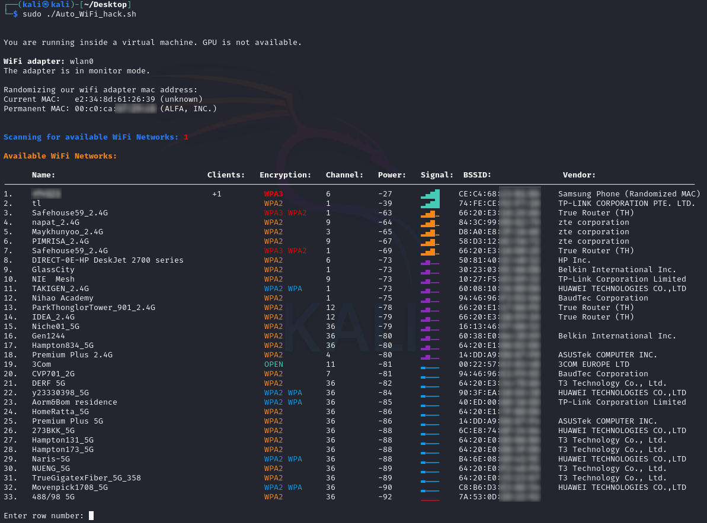
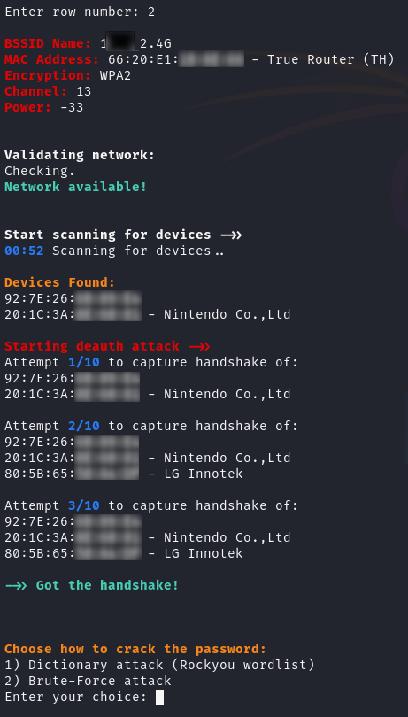
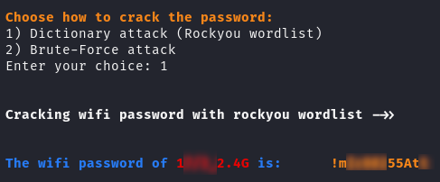
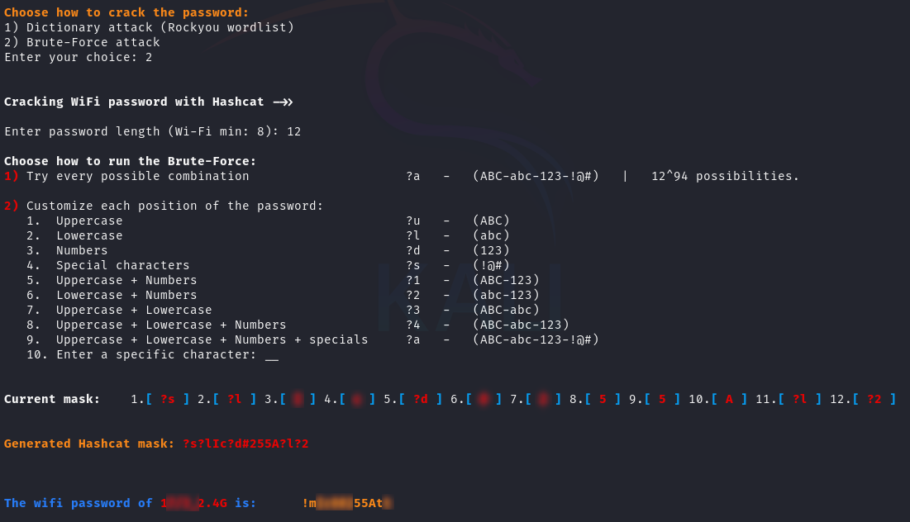

# Auto WiFi Password Hack Script

This script is designed to crack WiFi passwords by capturing the EAPOL handshake and then using the **rockyou** wordlist and **hashcat** for brute-forcing. 
If a GPU is available, it utilizes it for faster cracking.

Make sure you're connected to the internet before running the script to download the required dependencies.

## Features
- Automatically installs all dependencies.
- Installs GPU drivers and CUDA if a GPU is detected and the user wants to use it for faster cracking (does not work on VM).
- Downloads the **rockyou** wordlist if it doesn't already exist.
- Downloads the **OUI file** for identifying the vendors of APs (routers and devices).
- Automatically find the WIFI adapter and sets it to into monitor mode.
- Scan all networks around you and choose network to attack:
  
    
  
- The script will scan all devices that connected to that network and Deauth them from the router.
- The script will attempt to captures the EAPOL handshake of WiFi networks.

    
  
- After capturing the EAPOL the user will choose if to crack it with rockyou wordlist or brute-force with Hashcat.
- The crcking will utilizes GPU for faster cracking if available.

    Rockyou dictionary attack when found the WiFi password (run in gnome-terminal for better-looking).
    
  
- If you choose to brute-force I customized Hashcat for easy options, for example you can choose the length of the password and what characters/numbers/specials will be in each position.

    When customizing each position of the bruteforce:

    

    Note: The actual Hashcat Brute-Force run in gnome-terminal (the script open it on new terminal for better-looking).
  
- If the password found the script will write it to the file "wifi_passwords.txt" in the scan folder.


## Requirements
- Kali Linux or Ubuntu (work on Desktop versions because we using **gnome-terminal** for better-looking results).
- WiFi adapter capable of monitor mode.
- **hashcat** and **rockyou** wordlist (automatically handled by the script).

## Installation & Usage
1. Clone this repository:
   ```bash
   git clone https://github.com/idoCo10/Auto_WiFi_hack.git
   cd Auto_WiFi_hack
   sudo chmod +x Auto_WiFi_hack.sh
   sudo ./Auto_WiFi_hack.sh


## Legal Disclaimer
This tool is for authorized penetration testing and educational purposes only.
Using this script against networks without explicit permission is illegal and violates ethical standards.
The authors are not responsible for misuse of this tool.
