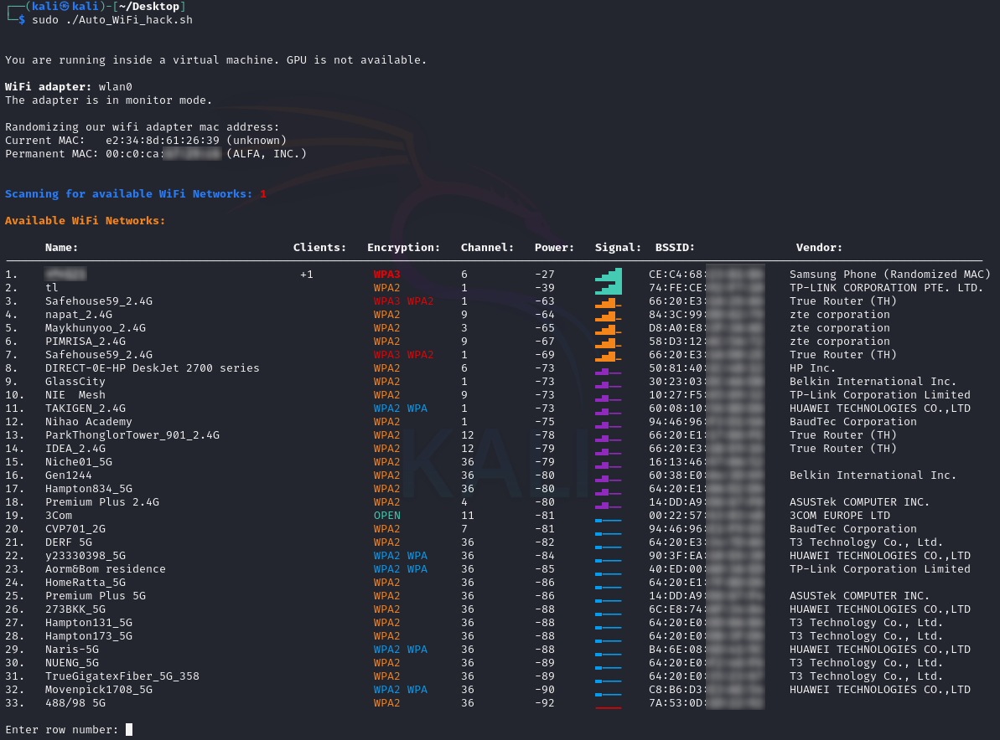
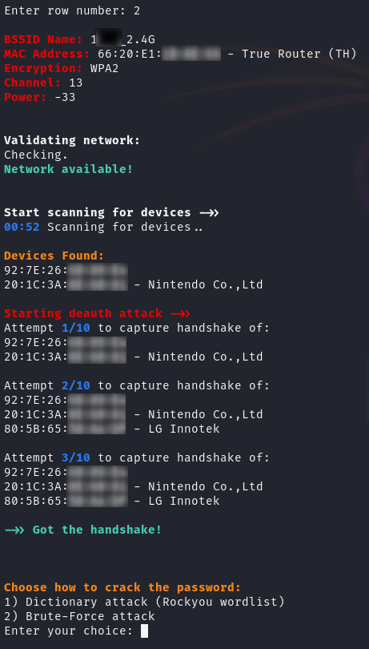
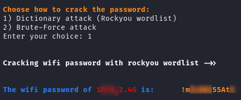
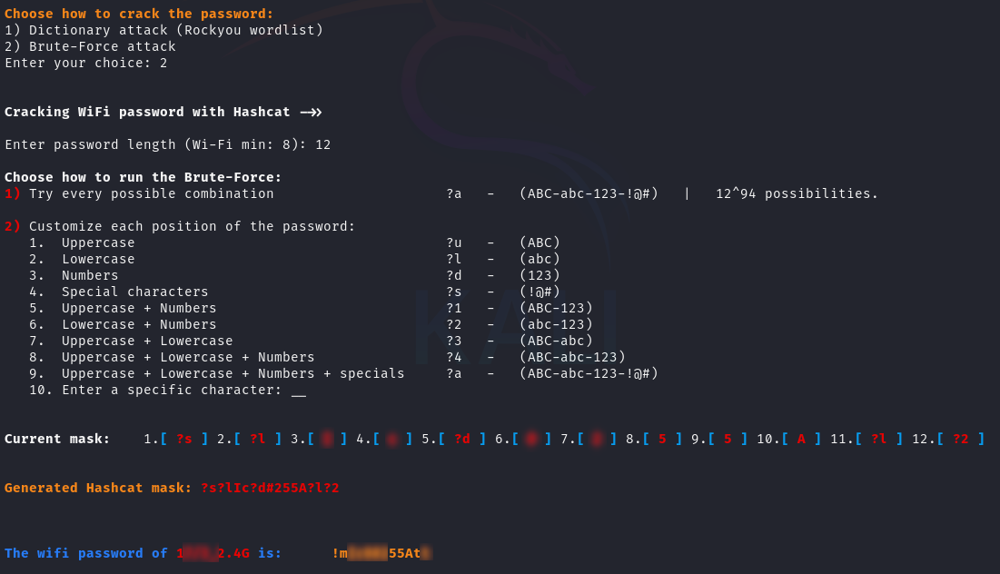

# Auto WiFi Password Hack Script

This script is designed to crack WiFi passwords by capturing the EAPOL handshake and then using the **rockyou** wordlist and **hashcat** for brute-forcing. 
If a GPU is available, it utilizes it for faster cracking.

Make sure you're connected to the internet before running the script to download the required dependencies.

## Features
- Automatically installs all dependencies.
- Installs GPU drivers and CUDA if a GPU is detected and the user wants to use it for faster cracking (does not work on VM).
- Downloads the **rockyou** wordlist if it doesn't already exist.
- Downloads the **OUI file** for identifying the vendors of APs (routers and devices).
- Automatically find the WIFI adapter and sets it to into monitor mode.
- Scan all networks around you and choose network to attack:
  
    
  
- The script will scan all devices that connected to that network and Deauth them from the router.
- The script will attempt to captures the EAPOL handshake of WiFi networks.
- Clearer indication of captured handshake type (EAPOL / PMKID) after conversion.

    
  
- After capturing the EAPOL (or PMKID), the user will choose if to crack it with rockyou wordlist or brute-force with Hashcat.
- Detects WPS-enabled networks, showing version and lock status, and offers targeted WPS attacks (Pixie-Dust & PIN brute-force via Reaver).
- Improved result parsing for more reliable password recovery from Hashcat and Reaver.
- The cracking process utilizes GPU for faster cracking if available and configured.

    Rockyou dictionary attack when found the WiFi password (run in gnome-terminal for better-looking).
    
  
- If you choose to brute-force with Hashcat, the script offers customized options, allowing you to specify password length and character sets for each position.

    When customizing each position of the bruteforce:

    

    Note: The actual Hashcat Brute-Force run in gnome-terminal (the script open it on new terminal for better-looking).
  
- If the password found (via Hashcat or Reaver), the script will write it to the file "wifi_passwords.txt" in the scan folder.

### WPS Attacks
- During network selection, if a chosen network is WPS-enabled, its WPS version and lock status are displayed.
- The user is then prompted if they wish to attempt a WPS attack.
- **Attack Options:**
    - **Pixie-Dust:** A fast attack targeting some vulnerable routers. Requires `pixiewps`.
    - **Standard PIN Brute-Force:** A slower method that attempts all possible PINs. Can take a very long time.
- Reaver's output is saved for review, and successful PSK or PIN recovery is reported.

## Requirements
- Kali Linux or Ubuntu (works on Desktop versions due to reliance on **gnome-terminal** for displaying attack processes in separate windows).
- WiFi adapter capable of monitor mode.
- Core tools like `aircrack-ng`, `hashcat`, `reaver` (for WPS attacks and `wash` scanning), `pixiewps` (for the Pixie-Dust WPS attack), `jq` (for processing scan data), and the `rockyou` wordlist are utilized. The script attempts to automatically install these dependencies if they are missing.

## Installation & Usage
1. Clone this repository:
   ```bash
   git clone https://github.com/idoCo10/Auto_WiFi_hack.git
   cd Auto_WiFi_hack
   sudo chmod +x Auto_WiFi_hack.sh
   sudo ./Auto_WiFi_hack.sh


## Legal Disclaimer
This tool is for authorized penetration testing and educational purposes only.
Using this script against networks without explicit permission is illegal and violates ethical standards.
The authors are not responsible for misuse of this tool.
